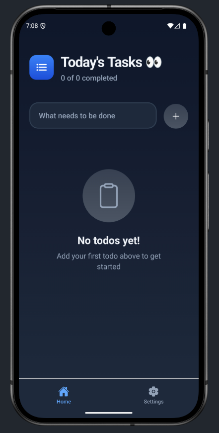
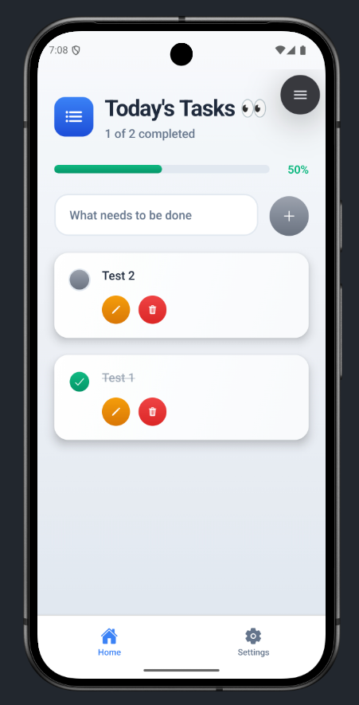
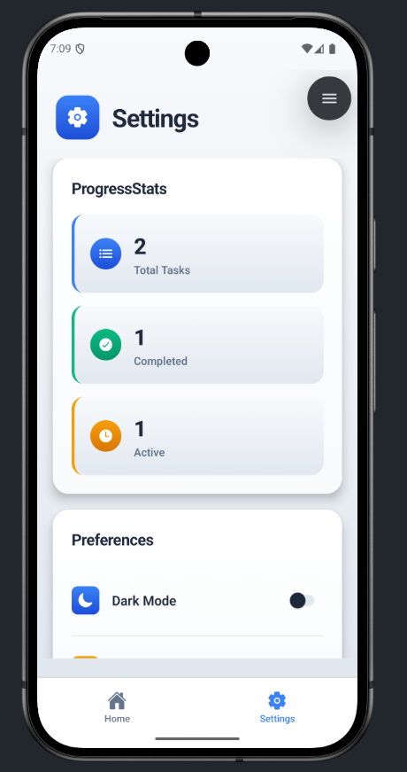
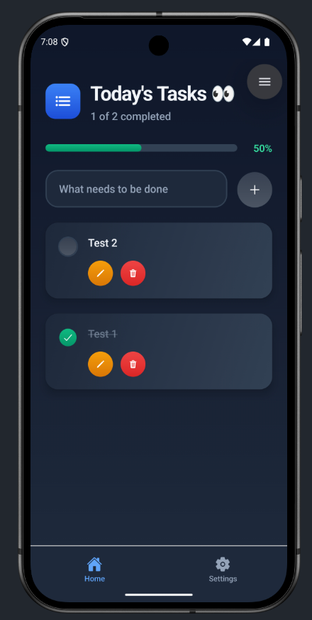
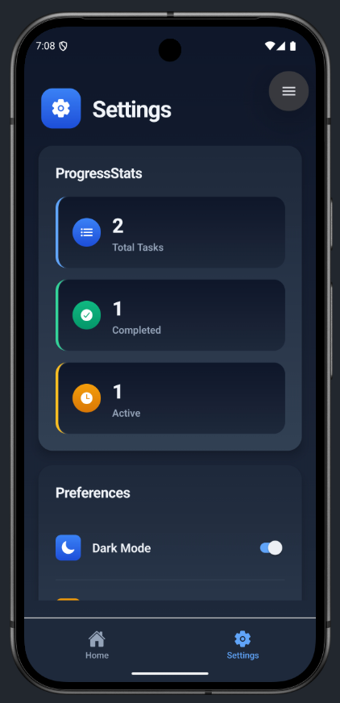

# 📝 TodoApp - React Native Todo Uygulaması

[🇺🇸 English](#english) | [🇹🇷 Türkçe](#turkce)

---

## 🇹🇷 Türkçe {#turkce}

Modern ve kullanıcı dostu bir React Native Todo uygulaması. Gerçek zamanlı senkronizasyon, güzel gradyan tasarım ve dark/light tema desteği ile geliştirilmiştir.

### ✨ Özellikler

- 📱 **Cross-Platform**: iOS, Android ve Web desteği
- 🎨 **Modern UI**: LinearGradient ile güzel tasarım
- 🌓 **Tema Desteği**: Dark ve Light mod
- ⚡ **Gerçek Zamanlı**: Convex backend ile anlık senkronizasyon
- 📊 **İstatistikler**: İlerleme durumu takibi
- 🔄 **CRUD İşlemleri**: Todo ekleme, düzenleme, silme ve tamamlama
- 📱 **Responsive**: Tüm cihaz boyutlarına uyumlu
- 🎯 **TypeScript**: Type-safe kod yazımı

### 🛠️ Teknoloji Stack

- **Framework**: React Native 0.79.5
- **Platform**: Expo ~53.0.20
- **Backend**: Convex (Gerçek zamanlı database)
- **Navigation**: Expo Router
- **Language**: TypeScript
- **Styling**: LinearGradient + Custom Styles
- **State Management**: Convex React Hooks
- **Icons**: Expo Vector Icons (Ionicons)

### 📱 Ekran Görüntüleri

#### Light Theme
| Ana Sayfa | Todo Listesi | Ayarlar |
|-----------|--------------|---------|
|  |  |  |

#### Dark Theme
| Ana Sayfa | Todo Listesi | Ayarlar |
|-----------|--------------|---------|
|  |  |  |

### 🚀 Kurulum ve Çalıştırma

#### Gereksinimler
- Node.js (v16 veya üzeri)
- npm veya yarn
- Expo CLI
- Convex hesabı

#### Adımlar

1. **Projeyi klonlayın**
   ```bash
   git clone https://github.com/grkndev/TodoApp.git
   cd TodoApp
   ```

2. **Bağımlılıkları yükleyin**
   ```bash
   npm install
   # veya
   yarn install
   ```

3. **Convex'i ayarlayın**
   ```bash
   npx convex dev
   ```
   - Convex hesabınızla giriş yapın
   - Proje ayarlarını tamamlayın

4. **Uygulamayı başlatın**
   ```bash
   npm start
   # veya
   expo start
   ```

5. **Platform seçenekleri**
   ```bash
   # Android
   npm run android
   
   # iOS
   npm run ios
   
   # Web
   npm run web
   ```

### 📁 Proje Yapısı

```
TodoApp/
├── app/                          # Ana uygulama dosyaları
│   ├── (tabs)/                   # Tab navigation sayfaları
│   │   ├── index.tsx            # Ana sayfa (Todo listesi)
│   │   └── settings.tsx         # Ayarlar sayfası
│   └── _layout.tsx              # Ana layout
├── components/                   # Yeniden kullanılabilir bileşenler
│   ├── TodoInput.tsx            # Todo ekleme input'u
│   ├── EmptyState.tsx           # Boş durum gösterimi
│   ├── Header.tsx               # Sayfa başlığı
│   ├── LoadingSpinner.tsx       # Yüklenme animasyonu
│   ├── ProgressStats.tsx        # İlerleme istatistikleri
│   ├── Preferences.tsx          # Tercih ayarları
│   └── DangerZone.tsx          # Tehlikeli işlemler
├── convex/                      # Backend (Convex)
│   ├── schema.ts               # Veri modeli
│   └── todos.ts                # Todo işlemleri
├── hooks/                       # Custom React hooks
│   └── useTheme.tsx            # Tema yönetimi
├── assets/                      # Statik dosyalar
│   ├── styles/                 # Stil dosyaları
│   └── images/                 # Görsel dosyalar
└── screenshoots/               # Ekran görüntüleri
```

### 🎯 Ana Özellikler

#### Todo Yönetimi
- ➕ **Ekleme**: Yeni todo öğeleri ekleme
- ✏️ **Düzenleme**: Mevcut todo'ları inline düzenleme
- ✅ **Tamamlama**: Todo durumunu toggle etme
- 🗑️ **Silme**: Onay dialogu ile güvenli silme

#### Tema Sistemi
- 🌙 **Dark Mode**: Göz yormayan karanlık tema
- ☀️ **Light Mode**: Aydınlık ve temiz tema
- 🔄 **Otomatik Geçiş**: Sistem tercihine göre otomatik tema

#### İstatistikler
- 📊 **İlerleme Takibi**: Tamamlanan/toplam todo oranı
- 📈 **Görsel Gösterim**: Progress bar ile görsel takip

### 🧩 Kullanılan Paketler

#### Ana Bağımlılıklar
- `react-native`: 0.79.5
- `expo`: ~53.0.20
- `convex`: ^1.25.4
- `expo-router`: ~5.1.4
- `expo-linear-gradient`: ~14.1.5
- `@expo/vector-icons`: ^14.1.0

#### Geliştirme Bağımlılıkları
- `typescript`: ~5.8.3
- `@types/react`: ~19.0.10
- `eslint`: ^9.25.0

### 🎨 Tasarım Sistemi

#### Renk Paleti
- **Primary**: Gradient mavi tonları
- **Success**: Yeşil tonlar (tamamlanan işlemler)
- **Warning**: Turuncu tonlar (düzenleme)
- **Danger**: Kırmızı tonlar (silme işlemleri)
- **Surface**: Card ve input arka planları için gradient

#### Tipografi
- **Headers**: Bold ve büyük fontlar
- **Body**: Okunabilir medium fontlar
- **Captions**: Küçük açıklama metinleri

### 🔧 Geliştirme

#### Yeni Özellik Ekleme
1. `components/` altında yeni component oluşturun
2. Gerekiyorsa `convex/` altında backend fonksiyonları ekleyin
3. `assets/styles/` altında stilleri tanımlayın
4. Theme sistemine uygun renkleri kullanın

#### Backend (Convex) Geliştirme
```typescript
// convex/todos.ts'de yeni mutation eklemek
export const newFunction = mutation({
  args: { /* args */ },
  handler: async (ctx, args) => {
    // implementation
  }
});
```

### 📈 Performans Optimizasyonları

- ⚡ **Lazy Loading**: Componentlerin ihtiyaç halinde yüklenmesi
- 🔄 **Real-time Updates**: Convex ile otomatik güncelleme
- 📱 **Responsive Design**: Tüm cihazlarda optimize performans
- 🎨 **Gradient Caching**: Stil optimizasyonları

### 🐛 Bilinen Sorunlar

Herhangi bir sorun ile karşılaştığınızda lütfen GitHub Issues'da bildirin.

### 🤝 Katkıda Bulunma

1. Fork yapın
2. Feature branch oluşturun (`git checkout -b feature/amazing-feature`)
3. Değişikliklerinizi commit edin (`git commit -m 'Add amazing feature'`)
4. Branch'inizi push edin (`git push origin feature/amazing-feature`)
5. Pull Request oluşturun

### 📄 Lisans

Bu proje kişisel öğrenme amaçlı geliştirilmiştir.

### 👨‍💻 Geliştirici

Bu uygulama React Native öğrenme sürecinin bir parçası olarak geliştirilmiştir.

**İletişim:**
- 🐙 **GitHub**: [github.com/grkndev](https://github.com/grkndev)
- 🌐 **Website**: [grkn.dev](https://grkn.dev)
- 📧 **Email**: [info@grkn.dev](mailto:info@grkn.dev)

---

## 🇺🇸 English {#english}

A modern and user-friendly React Native Todo application. Built with real-time synchronization, beautiful gradient design, and dark/light theme support.

### ✨ Features

- 📱 **Cross-Platform**: iOS, Android, and Web support
- 🎨 **Modern UI**: Beautiful design with LinearGradient
- 🌓 **Theme Support**: Dark and Light modes
- ⚡ **Real-Time**: Instant synchronization with Convex backend
- 📊 **Statistics**: Progress tracking
- 🔄 **CRUD Operations**: Add, edit, delete, and complete todos
- 📱 **Responsive**: Compatible with all device sizes
- 🎯 **TypeScript**: Type-safe code development

### 🛠️ Tech Stack

- **Framework**: React Native 0.79.5
- **Platform**: Expo ~53.0.20
- **Backend**: Convex (Real-time database)
- **Navigation**: Expo Router
- **Language**: TypeScript
- **Styling**: LinearGradient + Custom Styles
- **State Management**: Convex React Hooks
- **Icons**: Expo Vector Icons (Ionicons)

### 📱 Screenshots

#### Light Theme
| Home Screen | Todo List | Settings |
|-------------|-----------|----------|
|  |  |  |

#### Dark Theme
| Home Screen | Todo List | Settings |
|-------------|-----------|----------|
|  |  |  |

### 🚀 Installation & Setup

#### Requirements
- Node.js (v16 or higher)
- npm or yarn
- Expo CLI
- Convex account

#### Steps

1. **Clone the repository**
   ```bash
   git clone https://github.com/grkndev/TodoApp.git
   cd TodoApp
   ```

2. **Install dependencies**
   ```bash
   npm install
   # or
   yarn install
   ```

3. **Setup Convex**
   ```bash
   npx convex dev
   ```
   - Login with your Convex account
   - Complete project configuration

4. **Start the application**
   ```bash
   npm start
   # or
   expo start
   ```

5. **Platform options**
   ```bash
   # Android
   npm run android
   
   # iOS
   npm run ios
   
   # Web
   npm run web
   ```

### 📁 Project Structure

```
TodoApp/
├── app/                          # Main application files
│   ├── (tabs)/                   # Tab navigation pages
│   │   ├── index.tsx            # Home page (Todo list)
│   │   └── settings.tsx         # Settings page
│   └── _layout.tsx              # Main layout
├── components/                   # Reusable components
│   ├── TodoInput.tsx            # Todo input component
│   ├── EmptyState.tsx           # Empty state display
│   ├── Header.tsx               # Page header
│   ├── LoadingSpinner.tsx       # Loading animation
│   ├── ProgressStats.tsx        # Progress statistics
│   ├── Preferences.tsx          # Preference settings
│   └── DangerZone.tsx          # Dangerous operations
├── convex/                      # Backend (Convex)
│   ├── schema.ts               # Data model
│   └── todos.ts                # Todo operations
├── hooks/                       # Custom React hooks
│   └── useTheme.tsx            # Theme management
├── assets/                      # Static files
│   ├── styles/                 # Style files
│   └── images/                 # Image files
└── screenshoots/               # Screenshots
```

### 🎯 Core Features

#### Todo Management
- ➕ **Adding**: Create new todo items
- ✏️ **Editing**: Inline editing of existing todos
- ✅ **Completion**: Toggle todo status
- 🗑️ **Deletion**: Safe deletion with confirmation dialog

#### Theme System
- 🌙 **Dark Mode**: Eye-friendly dark theme
- ☀️ **Light Mode**: Clean and bright theme
- 🔄 **Auto Switch**: Automatic theme based on system preference

#### Statistics
- 📊 **Progress Tracking**: Completed/total todo ratio
- 📈 **Visual Display**: Visual tracking with progress bar

### 🧩 Used Packages

#### Main Dependencies
- `react-native`: 0.79.5
- `expo`: ~53.0.20
- `convex`: ^1.25.4
- `expo-router`: ~5.1.4
- `expo-linear-gradient`: ~14.1.5
- `@expo/vector-icons`: ^14.1.0

#### Development Dependencies
- `typescript`: ~5.8.3
- `@types/react`: ~19.0.10
- `eslint`: ^9.25.0

### 🎨 Design System

#### Color Palette
- **Primary**: Gradient blue tones
- **Success**: Green tones (completed operations)
- **Warning**: Orange tones (editing)
- **Danger**: Red tones (deletion operations)
- **Surface**: Gradients for card and input backgrounds

#### Typography
- **Headers**: Bold and large fonts
- **Body**: Readable medium fonts
- **Captions**: Small descriptive texts

### 🔧 Development

#### Adding New Features
1. Create new component under `components/`
2. Add backend functions under `convex/` if needed
3. Define styles in `assets/styles/`
4. Use theme-consistent colors

#### Backend (Convex) Development
```typescript
// Adding new mutation in convex/todos.ts
export const newFunction = mutation({
  args: { /* args */ },
  handler: async (ctx, args) => {
    // implementation
  }
});
```

### 📈 Performance Optimizations

- ⚡ **Lazy Loading**: Components loaded on demand
- 🔄 **Real-time Updates**: Automatic updates with Convex
- 📱 **Responsive Design**: Optimized performance on all devices
- 🎨 **Gradient Caching**: Style optimizations

### 🐛 Known Issues

Please report any issues you encounter on GitHub Issues.

### 🤝 Contributing

1. Fork the project
2. Create a feature branch (`git checkout -b feature/amazing-feature`)
3. Commit your changes (`git commit -m 'Add amazing feature'`)
4. Push to the branch (`git push origin feature/amazing-feature`)
5. Open a Pull Request

### 📄 License

This project was developed for personal learning purposes.

### 👨‍💻 Developer

This application was developed as part of the React Native learning process.

**Contact:**
- 🐙 **GitHub**: [github.com/grkndev](https://github.com/grkndev)
- 🌐 **Website**: [grkn.dev](https://grkn.dev)
- 📧 **Email**: [info@grkn.dev](mailto:info@grkn.dev)

---

## 🔗 Links

- [Expo Documentation](https://docs.expo.dev/)
- [React Native Documentation](https://reactnative.dev/)
- [Convex Documentation](https://docs.convex.dev/)
- [TypeScript Documentation](https://www.typescriptlang.org/)

---

**⭐ Bu projeyi beğendiyseniz yıldız vermeyi unutmayın! / If you liked this project, don't forget to give it a star!**